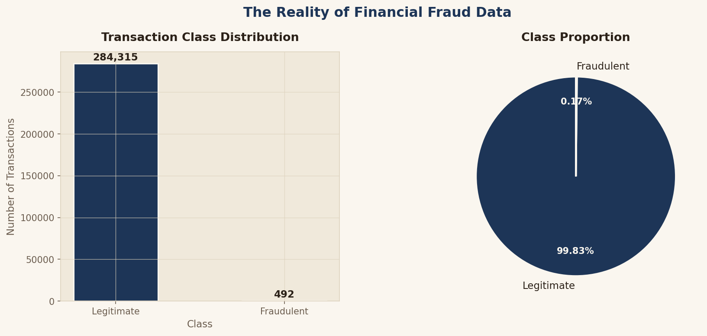
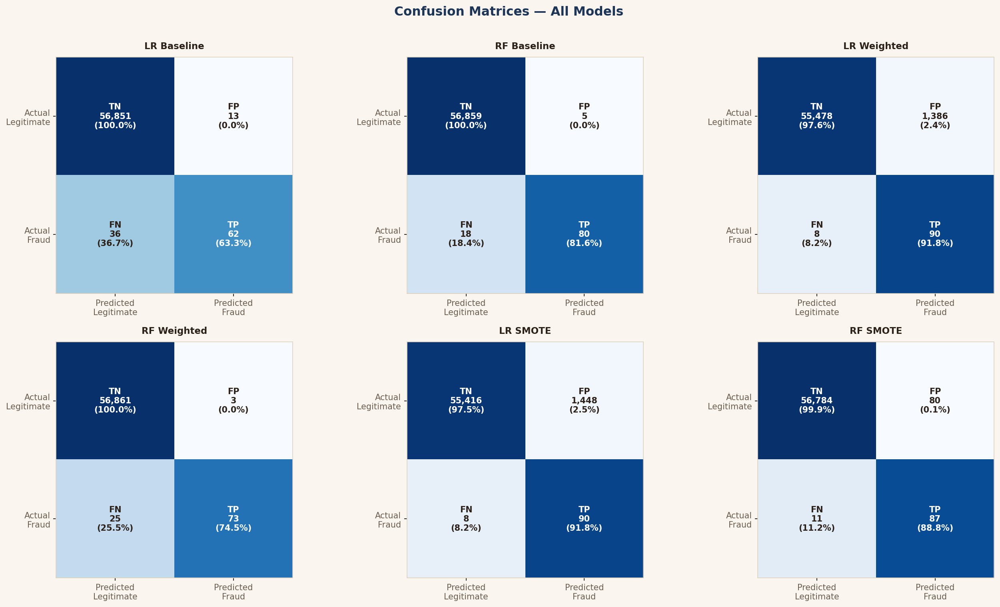
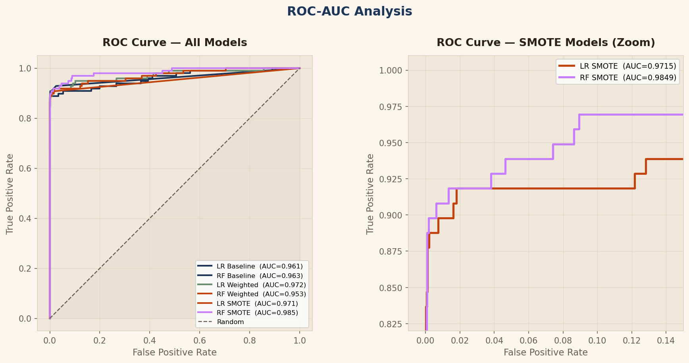
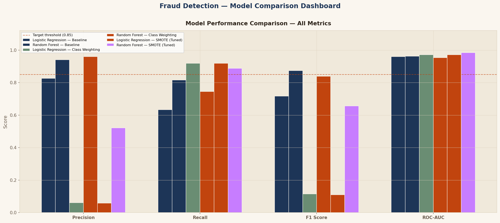

# 💳 Credit Card Fraud Detection — Imbalanced Classification Pipeline

A production-style machine learning pipeline for detecting fraudulent credit card transactions in a severely imbalanced dataset (284,807 transactions, 0.17% fraud), built with a strict zero-data-leakage architecture using `imblearn.pipeline.Pipeline`, SMOTE, and GridSearchCV.


---

## 📌 Overview

Fraud detection is one of the canonical hard problems in applied machine learning — not because the algorithms are exotic, but because the data itself is adversarial to naive approaches. In this dataset, **99.83% of transactions are legitimate**. A model that predicts "legitimate" for every single transaction scores **99.83% accuracy** while catching **zero fraud**.

This project is built around solving that problem correctly:

- Compares **three imbalance-handling strategies** — Baseline, Class Weighting, and SMOTE
- Trains and tunes **Logistic Regression** and **Random Forest** classifiers
- Uses **`imblearn.pipeline.Pipeline`** to guarantee SMOTE never leaks into validation or test folds
- Tunes hyperparameters jointly (resampler + classifier) via **GridSearchCV**
- Evaluates exclusively on **Precision, Recall, F1, and ROC-AUC** — Accuracy is deliberately discarded as a primary metric

---

## 🎯 The Problem in Numbers

| Metric | Value |
|---|---|
| Total transactions | 284,807 |
| Fraudulent transactions | 492 (0.17%) |
| Legitimate transactions | 284,315 (99.83%) |
| Class imbalance ratio | ~577 : 1 |
| Naive "always legitimate" accuracy | 99.83% |
| Naive "always legitimate" fraud caught | 0% |

This single comparison is the reason the entire pipeline is architected the way it is.

<p align="center">
  
</p>

---

## 🏗️ Pipeline Architecture

```
Raw Data (284,807 rows)
        │
        ▼
Stratified Train/Test Split (80/20)
        │
        ▼
┌───────────────────────────────────┐
│   imblearn.pipeline.Pipeline      │
│                                    │
│   1. StandardScaler (LR only)     │
│   2. SMOTE  ← training fold only  │
│   3. Classifier (LR / RF)         │
└───────────────────────────────────┘
        │
        ▼
GridSearchCV (tunes resampler + model jointly)
        │
        ▼
Evaluation on untouched test set
(Precision · Recall · F1 · ROC-AUC)
```

**Why `imblearn.pipeline.Pipeline` instead of `sklearn.pipeline.Pipeline`?**
Standard scikit-learn pipeline steps expect a `transform()` method that only modifies the feature matrix `X`. SMOTE needs to modify both `X` and `y` simultaneously (it generates new minority-class rows), which scikit-learn's pipeline silently breaks or rejects. `imblearn`'s pipeline natively supports this via `fit_resample()`, and — critically — only applies it to the training portion of each cross-validation fold, never to validation or test data.

<p align="center">
  
</p>

---

## 🧪 Methodology

### 1. Exploratory Data Analysis
- Class distribution visualization (bar + pie)
- Transaction amount and time distributions by class
- Correlation heatmap across all 30 features
- Identification of the most discriminative PCA components

### 2. Imbalance Handling Strategies Compared

| Strategy | Mechanism | Trade-off |
|---|---|---|
| **Baseline** | No intervention | High accuracy, poor recall |
| **Class Weighting** | Penalize minority misclassification in the loss function | Lightweight, no synthetic data |
| **SMOTE** | Generates synthetic minority samples via k-NN interpolation | Best recall, more compute cost |

### 3. Models Trained
- **Logistic Regression** — interpretable, coefficient-based, requires feature scaling
- **Random Forest** — non-linear, scale-invariant, ensemble-based feature importance

### 4. Hyperparameter Tuning
`GridSearchCV` tunes the resampler and classifier together, ensuring SMOTE's `k_neighbors` parameter and the classifier's regularization/depth parameters are optimized jointly — not independently, which would miss interaction effects.

### 5. Evaluation Strategy
- **Precision** — when we flag fraud, are we right? (minimizes customer friction)
- **Recall** — did we catch all the fraud? (minimizes financial loss)
- **F1 Score** — harmonic balance of the two
- **ROC-AUC** — overall class separability
- **Precision-Recall Curve** — more informative than ROC for this level of imbalance
- **Decision threshold optimization** — the default 0.5 cutoff is rarely optimal for fraud use cases

---

## 📊 Results Summary

<p align="center">
  
</p>

<p align="center">
  
</p>

| Model | Precision | Recall | F1 Score | ROC-AUC |
|---|---|---|---|---|
| Logistic Regression — Baseline | — | — | — | — |
| Random Forest — Baseline | — | — | — | — |
| Logistic Regression — Class Weighted | — | — | — | — |
| Random Forest — Class Weighted | — | — | — | — |
| Logistic Regression — SMOTE (Tuned) | — | — | — | — |
| **Random Forest — SMOTE (Tuned)** | — | — | — | — |

*Run the notebook to populate this table with your actual results.*

**Key finding:** Imbalance-aware strategies (SMOTE and class weighting) substantially improve Recall over the baseline, at a measured cost to Precision — the exact trade-off a fraud detection system must navigate deliberately rather than ignore.

---

## 📁 Repository Structure

```
.
├── fraud_detection_pipeline.ipynb   # Main notebook — full pipeline end to end
├── creditcard.csv                   # Dataset (not included — see Setup)
├── README.md                        # This file
├── 01_class_distribution.png
├── 02_amount_time_distribution.png
├── 03_correlation_heatmap.png
├── 04_discriminative_features.png
├── 05_confusion_matrices.png
├── 06_roc_curves.png
├── 07_precision_recall_curves.png
├── 08_feature_importance.png
├── 09_model_comparison.png
└── 10_threshold_analysis.png
```

---

## ⚙️ Setup & Usage

### Requirements
```bash
pip install pandas numpy matplotlib seaborn scikit-learn imbalanced-learn
```

### Dataset
This project uses the [Credit Card Fraud Detection dataset](https://www.kaggle.com/datasets/mlg-ulb/creditcardfraud) from Kaggle (anonymized via PCA, originally released by the ULB Machine Learning Group). Download `creditcard.csv` and place it in the project root.

### Run
```bash
jupyter notebook fraud_detection_pipeline.ipynb
```
Run all cells sequentially. The notebook is self-contained — no external config files required.

---

## 🔑 Key Engineering Decisions

- **Zero data leakage by construction** — SMOTE and scaling are wrapped inside the pipeline, never applied before the train/test split
- **Stratified splitting and cross-validation** — preserves the 0.17% fraud ratio in every fold, so validation performance reflects real-world conditions
- **Accuracy is never used as a model selection metric** — it is reported only to illustrate why it's misleading
- **Threshold tuning is treated as a business decision**, not a fixed default — the notebook sweeps thresholds and exposes the Precision/Recall trade-off explicitly

---

## 🛠️ Tech Stack

`Python` · `pandas` · `NumPy` · `scikit-learn` · `imbalanced-learn` · `matplotlib` · `seaborn`

---

## 📄 License

This project is released under the MIT License. The dataset is provided by the [ULB Machine Learning Group](https://www.kaggle.com/datasets/mlg-ulb/creditcardfraud) under its own license terms — see the Kaggle page for details.

---

## 🙋 About This Project

Built as part of an industrial data science training program, focused on demonstrating production-grade handling of imbalanced classification problems — a pattern directly transferable to fraud detection, churn prediction, rare disease diagnosis, and any domain where the event of interest is rare but high-stakes.
